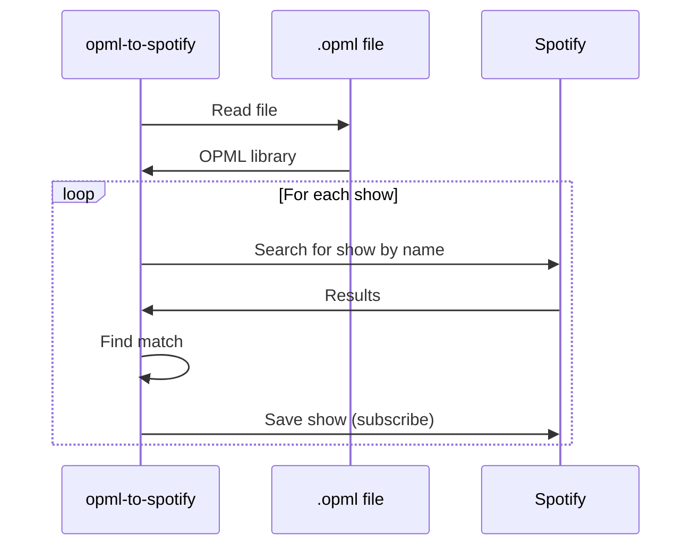
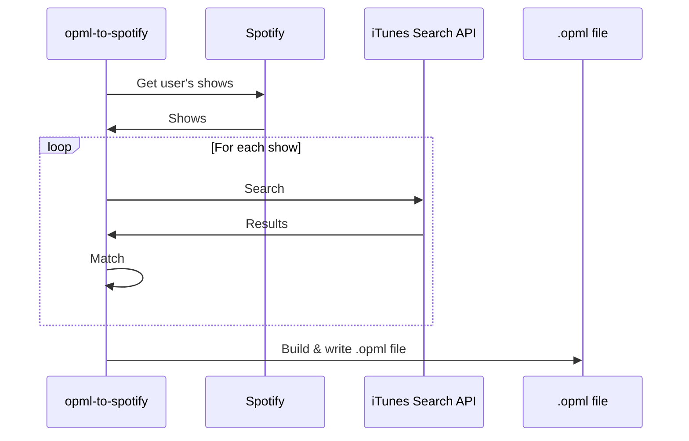

# opml-to-spotify

`opml-to-spotify` allows you to import and export your current podcast library into and out of Spotify. It's a super simple command-line tool which runs on your own machine.

## Usage

> :warning: until `opml-to-spotify` is approved by Spotify you will need to follow the additional instructions for [using your own application](#Using-your-own-application) below 

* Export your podcast library out of your old podcast app as an OPML (`.opml`) file
* Download the binary for your OS from the latest release on the [releases](https://github.com/elliotwms/opml-to-spotify/releases) page
* Run the following:
```shell
$ ./opml-to-spotify import {filename}.opml
```

### Using your own application

During local development, and until the official `opml-to-spotify` application is approved, it will be necessary for you to use your own Spotify developer application to call the spotify API 

* [Create an application on Spotify](https://developer.spotify.com/dashboard/applications)
  * Obtain the Client ID
  * Add a redirect URI for `http://localhost:8080/callback`
* When running the application, specify the client ID ith either flags (`-c {id}`) or environment variables (`SPOTIFY_ID`)

## How it works

`opml-to-spotify` is a Spotify application, and when run it will ask you to log in to it via your Spotify account by providing you a link to open in your browser.

Commands which require access to the Spotify API will require you to log in. It implements the [Authorization Code Flow with PKCE extension, which is documented here](https://developer.spotify.com/documentation/general/guides/authorization/code-flow/)

### Importing

```shell
$ ./opml-to-spotify import --help
```

As you're unable to add a podcast to Spotify via RSS, `opml-to-spotify` searches the Spotify API for shows matching the title of your current list. This means you're likely to miss shows (it'll log when this happens and you can use the `-m` flag to specify a file to output these to), but it's Better Than Nothing :tm:! A couple reasons it might not show up include:
  * Private RSS feeds
  * Shows which aren't in the Spotify catalog



### Exporting

It is also possible via `opml-to-spotify` to go the other way, `spotify-to-opml`!

There's currently no official way to export your shows from Spotify, and the API doesn't expose enough information required to build an OPML file, so `opml-to-spotify` makes use of the iTunes Search API and again searches for shows exactly matching by title. This means that your show won't get exported if it's:
* Spotify exclusive :(
* Not in the iTunes Podcast directory



## Support

You can support this project by:
* Using it and reporting bugs
* Contributing (ideas and code!)
* Buying me a beer
* Donating to a small/local charity of your choice
